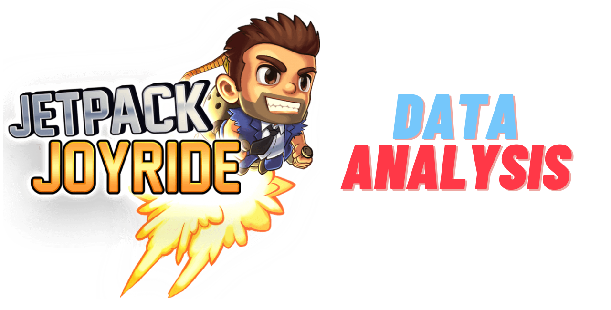

## Overview

- Data Analytics project of JetPack Joyride in collaboration with [Halfbrick](https://www.halfbrick.com/), the studio that brought to life this video game. 
- The project consists of:
  - The training of several Machine Learning models to predict the player retention, ranging from a simple Linear Model to more complex ones such as Random Forests or a Neural Network.
  - A brief Data Visualization section with Tableau.
- The project does not contain any Data file for confidentiality reasons.

## Contents:

- Data Analysis:
1. `machine_learning.ipynb` - It contains the whole coding of the project, including formulas and comments explaining the whole process.
2. `data_exploration.ipynb` - Data visualization dashboard created with Tableau.

- Other folders
1. results - Contains the predictions of some models alongside the actual values for comparison.
2. models - Contains all the fitted Models stored in pkl files.
3. transformers - Contains all the fitted Transformers/Scalers stored in a pkl file.
4. encoders - Contains all Encoders on stored in pkl files.

## Acknowledgements:

- Thanks to [Halfbrick](https://www.halfbrick.com/) for letting us work with real data about their fantastic video game!

## Installation and use:

1. Clone this repo
2. Install all the requirements from the requirements.txt file
